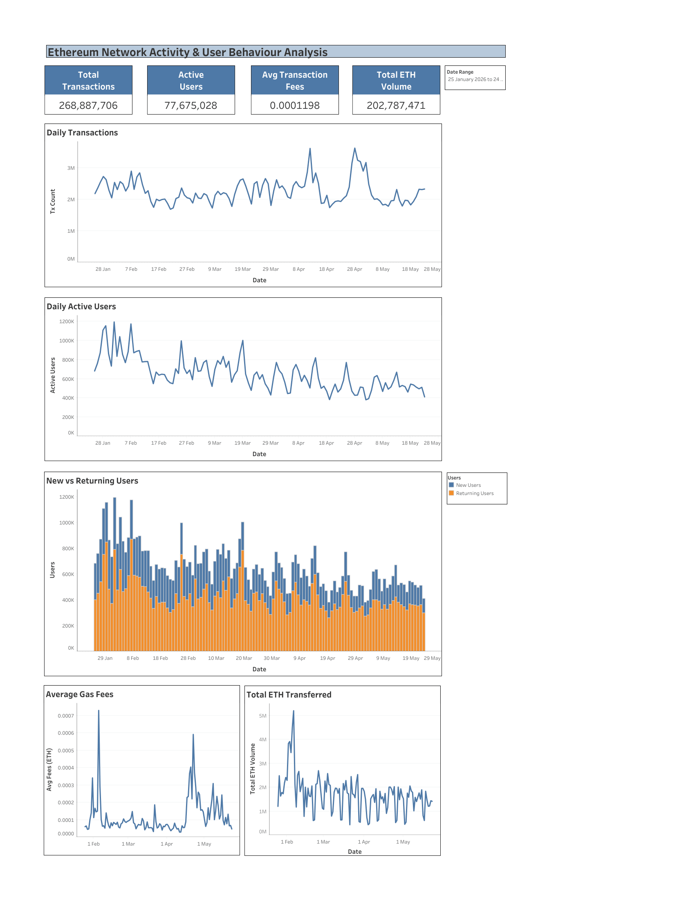

# Ethereum Network Activity & User Behaviour Analysis

## Dashboard Preview

### Project Overview
A 120-day analysis of Ethereum network activity (Jan–May 2026), 
built using Dune Analytics and visualized in Tableau.

### Tools Used
- Dune Analytics (data source)
- Google Sheets (data pipeline)
- Tableau (dashboard)

### Key Findings
- 202M+ total transactions over 120 days
- 65.7% of daily activity driven by returning users
- 36.7% decline in active users from first to last 30 days
- Gas fee spike in April reached 10x the baseline average

### Files
- `Ethereum Network Activity.pdf` — Full written report
- `Ethereum_Data.csv` — Raw data exported from Dune
- `Dashboard.png` — Tableau dashboard screenshot

### Live Dashboard
View the interactive dashboard here:
[Ethereum Network Dashboard](https://public.tableau.com/views/EthereumActivityDashboard/Dashboard1?:language=en-GB&publish=yes&:sid=&:redirect=auth&:display_count=n&:origin=viz_share_link)
